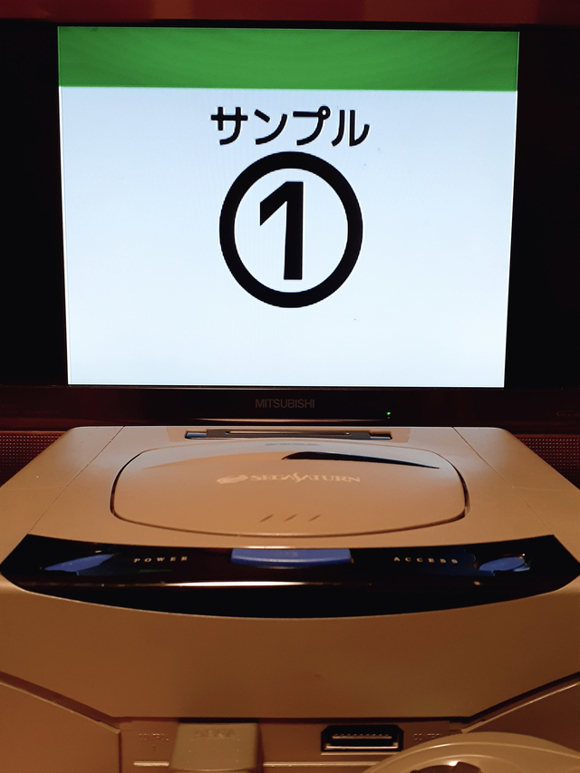

# sh_ss_slideshow

セガサターンで動作するスライドショーのディスクイメージを生成するシェルスクリプトです。

- エミュレータ(Yabause)で実行している様子  
  
- 実機で実行している様子  
  
- デモ(YouTube)  
  https://youtu.be/Cf2OsA-tPDM

## ディスクイメージ生成手順

1. このリポジトリをダウンロードあるいはclone
2. imagesディレクトリに画像を配置
3. `scripts/src/main.sh`の20行目辺りにある`NUM_IMGS_DEC`へ画像枚数を設定
   ```shell-script
   ...
   ## スライドショーの画像枚数(10進数で指定)
   NUM_IMGS_DEC=<画像枚数>
   ...
   ```
4. シェル上でこのリポジトリのディレクトリへ移動し`build.sh`を実行
   ```bash
   $ cd /path/to/sh_ss_slideshow/
   $ ./build.sh
   ```
5. `build.sh`が完了すると、セガサターン向けディスクイメージ(`sh_ss_slideshow.cue`・`sh_ss_slideshow.iso`)ができあがる

## 実行環境

bashでビルドしますので、Linux環境を用意するか、Windowsの場合はWindows Subsystem for Linuxを使用するなどしてください。

標準では入っていない可能性のあるコマンドは以下の通りです。適宜インストールしてください。

| コマンド | (参考)Debianパッケージ名 |
| ---- | ---- |
| make | make |
| wget | wget |
| convert | imagemagick |

## imagesディレクトリに配置する画像について

このディレクトリに配置した画像がディスクイメージに組み込まれ、スライドショーの対象になります。

- スライドショーの順番はファイル名順
- 画像枚数は51枚まで
- 配置できるのは画像ファイルだけ
  - ディレクトリは作らないでください
- ファイル名にはシングルクォート・ダブルクォート・空白などを含めない
  - アルファベット大文字/小文字・数字と記号は'-'(ハイフン)・'_'(アンダースコア)のみにしておくのが安全です
- 解像度は320x224[px]と同じアスペクト比にしておくと良い
  - 解像度に指定はありませんが、セガサターン向けの画像形式へ変換する過程で320x224[px]へリサイズします
  - アスペクト比は無視してリサイズしますので、320x224と同じアスペクト比で作っておくと良いです
- 画像形式にも特に指定なし
  - ImageMagickを使用していますので、ImageMagickでも対応していないような画像形式は扱えません
  - たいていの画像形式には対応していますので問題ないと思いますが

## スライドショーの操作方法

使用するのは十字キーの`←`と`→`だけです。

| ボタン | 機能 |
| ---- | ---- |
| ← | 前の画像へ戻る |
| → | 次の画像へ進む |

## 備考

- 実機での動作確認は[Satiator](https://www.satiator.net/)で行いました
- エミュレータでの動作確認は[Yabause](https://yabause.org/)と[Mednafen](https://mednafen.github.io/)で行いました
- ボタン押下の反応速度を調整したい場合は`scripts/src/pad.sh`内のシェル変数`BUTTON_PRESSED_TH`を調整してください
  - 押下判定のしきい値で、長くするほど反応が鈍くなります
  - 設定値は4桁の16進数です
  - ただ、「ボタン判定後に画像をディスクからロードする」作りの都合上、上記の変数を0にしても、ボタン押下から画像表示までの遅延を0にすることはできません
